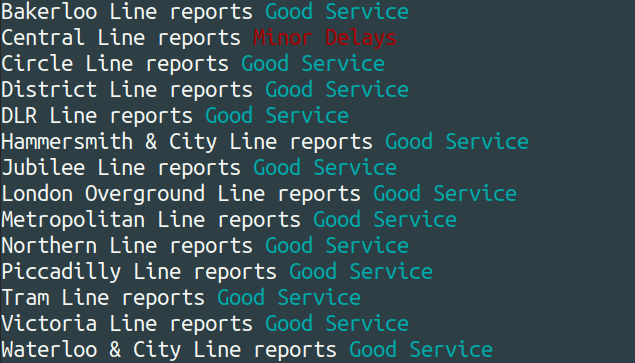

# **Utility for tube lines status**
---

This program will print the status of the London train lines. 
It prints on the terminal information about the status of the 
train lines as taken from the tfl API. The user can specify 
whether they need all the lines (tube, tram, DLR and London 
Overground), or any of them by parsing the appropriate 
argument when running the program. The output of the request 
is saved in a file called outputLinesStatus.csv. 
The program requests from server if more than 5 minutes 
have passed, otherwise it prints the output of the last 
request. Required amendments and will be included in due time.

## **Getting Started**

### **Prerequisites**
Python 3.6 or newer
See requirements.txt for packages.

### **Running the tests**
Simply type `./test_trainsLinesStatus.py`

### **Examples** 

## **Authors** 
* [Iria Pantazi](iria.a.pantazi@gmail.com)

## **Why logging**

