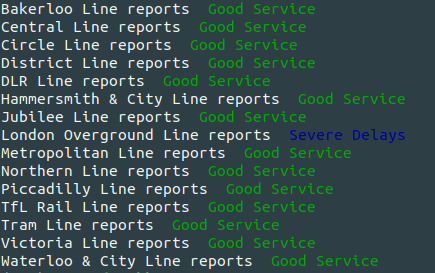

# **Utility for tube/tram/DLR/overground lines status**
---

This utility is a small program written in Python 
that prints information on the status of lines 
provided by the tfl API. The user can specify 
whether they need the status of all the lines 
(tube, tram, DLR and London Overground), or any 
one of them, by parsing the appropriate 
arguments when running the program. 
The output of the request is printed on the 
standard output, and saved in a file named 
`outputLinesStatus.csv`. 

## **Getting started**

### **Prerequisites**
The program is written in Python 3.6 and can run 
with Python versions 3.7 and 3.8. The program will 
exit if it is used Python 2.7.
It is suggested that the user creates a virtual environment. 
Such packages for creating and using virtual environments are 
[mkvirtualenv](https://realpython.com/python-virtual-environments-a-primer/) 
and [pyenv](https://realpython.com/intro-to-pyenv/).
After initialising a virtual environment, the user 
has to install the package requirements with the command 
`pip install -r requirements.txt`.

### **Running the tests**
After having installed the required packages, the user should 
run the tests by using the command  
`pytest` or `python -m unittest tests/test_trainsLinesStatus.py`. 

## **Information on input and output**
The program provides a  variation of argumants that can be parsed. 
These are:
1. `-m` for providing the desired modes, e.g. tram.
2. `-a` for all the available tfl modes.
3. `-f` for forcing a request.
4. `-t` for specifying the time that has passed before a new request to the API is done.
5. `-o` for setting the file that the output of the request is written. 
6. `-l` for specifying the logging level.

They are also available through the command 
`./tfl_requests/trainsLinesStatus.py -h`.

### **Example output**

Requesting all line modes with `./tfl_requests/trainsLinesStatus.py -a` example output:

## **Further Amendments**
There is a number of corrections/amendments that will be done 
in due time. These include:

- Logging:
    - Fix the timestamp in LOGFILE.
    - Option of defining logging level through an integer.
    - Uppercase in logging lever to be asserted or corrected by program.
    - Critical log messages that lead to system exit to be printed on stdout.

- Testing:
    - Include tests for parser.
    - Merge duplicate tests and account for all exceptions.
    - Include a tox.ini file for testing automation. 

- Python versions:
    - Support for Python 3.4 and 3.5.

- Miscellaneous:
    - Include more output figures.
    - Reduce hard-coded values.
    - If new request with a different valid mode is performed within less than ttl 
    seconds, then either do the request, or print only the requested mode(s) requested.
    - Incluse a setup.py file.

## **Authors** 
If you have any suggestions/corrections, 
please contct [Iria Pantazi](iria.a.pantazi@gmail.com).

